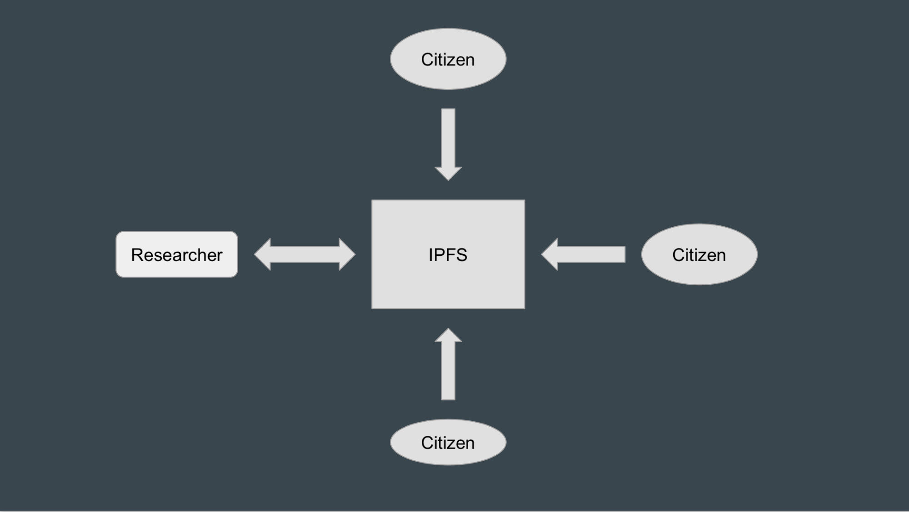

Marco Rodriguez

marco.rodriguez113@gmail.com

Project: Creating a tool to decentralize the citizen science model using IPFS

The way this will work is having my program running in the background of the user's computer, when they want to contribute an observation they will move their files to a certain directory of their choosing or the default and from there the files will get automatically uploaded to IPFS.

The resulting hashes will be sent over to the researcher and from there the files will be automatically uploaded to MongoDB which only the researcher(s) have access to.

An example of how the files in this repository tie in together is: 

extract_hashes:
	This file assumes that you have a file with hashes called 'Hashes'. The hashes are id's for files in ipfs.
	This script will read the contents of those files and create a file called 'hash_outputs' where each line is the contents of each one of those hashes in 'Hashes'.
	'hash_outputs' is used in /src/main.go to take those outputs and add them into mongodb.
