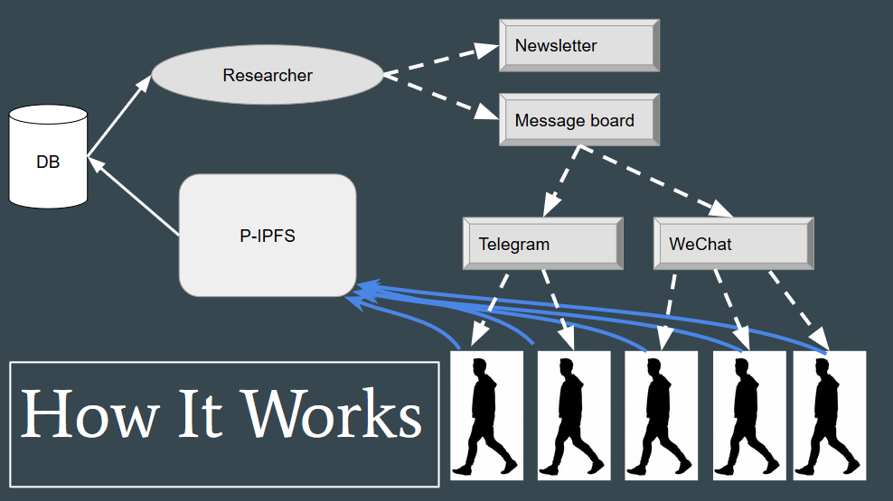

Marco Rodriguez

marco.rodriguez113@gmail.com

Project: Creating a tool to decentralize the citizen science model using IPFS

The way this will work is having my program running in the background of the user's computer, when they want to contribute an observation they will move their files to a certain directory of their choosing or the default and from there the files will get automatically uploaded to IPFS.

The resulting hashes will be sent over to the researcher and from there the files will be automatically uploaded to MongoDB which only the researcher(s) have access to.

An example of how the files in this repository tie in together is: 

Files in this Dir:

init_network: (run ./init_network <num-of-containers-to-init> )
	This creates a private ipfs network running on docker containers. You must pass it the number of docker containers you want to instantiate > 1. You must have ipfs running on your computer to connect the docker containers talk with your local computer via IPFS. This is so they know what Peer to connect to on bootup. The script creates them, and runs the pubsub experimental feature so one can run `docker exec <container-name> ipfs pubsub sub <topic>` (and your termainal will hang waiting for things to get published under that topic) and `docker exec <container-name> ipfs pubsub pub <topic-to-publish-to> <data>` (to publish something for anyone else to catch under that same <topic>). The script checks for if your containers exists already and then starts them. Else creates given number of containers. In both cases it removes bootstrap nodes and adds your local ipfs node to the bootstrap list.

stop_network (run ./stop_network):
	Stops all containers and removes them. Good for starting from scratch if ipfs network communication/messaging/etc.. got messed up.

extract_hashes:
	Take a file hash and grabs the content from IPFS and adds it into a db (in our case mongoDB). This file assumes that you have a file with hashes called 'Hashes'. Hashes file is actually created automatically using autoDownload.sh which. Will create a temp file called hash_outputs to add into mongodb via the program in /src/main.go.
	
